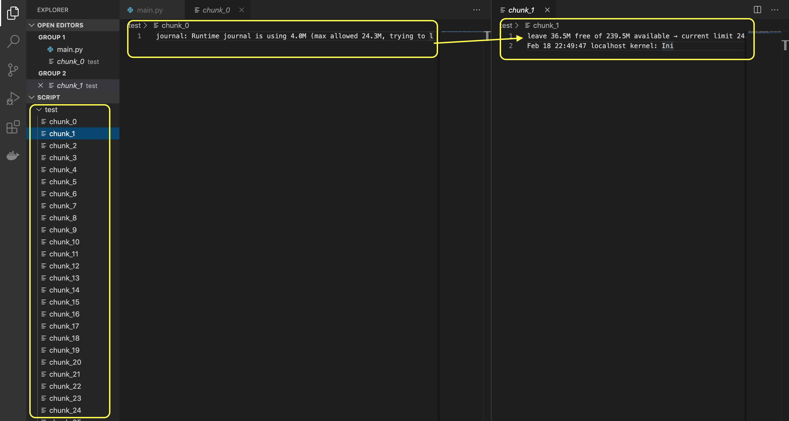

# Usage

`python main.py log.txt` it will create test directory to store all chuncked files each file will have 100 characters

- If it’s a broken word, add it to next file


# Validation 
## In the attached log file ([log.txt](https://github.com/shaikmdrafi/chunk-logfile/blob/master/log.txt))
- first line in log looks like 
```
Feb 18 22:49:47 localhost journal: Runtime journal is using 4.0M (max allowed 24.3M, trying to leave 36.5M free of 239.5M available → current limit 24.3M).
```

My goal is to have 100 characters in a single chunk , so the word `leave` is broken .

I am adding the broken word into next chunk as per the requirement .


